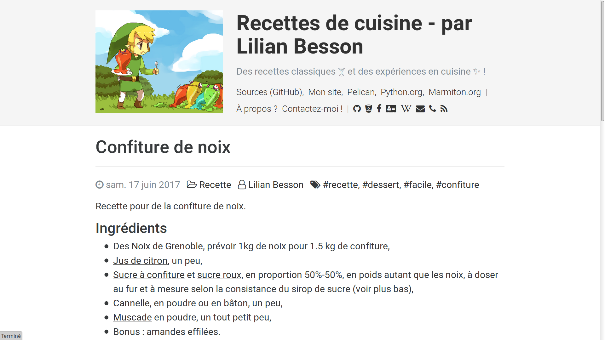

# Recettes de cuisine ! :fr:
## *Des recettes classiques 🍸 et des expériences en cuisine ✨ !*

Ce projet contiens les sources pour [ce dossier](https://perso.crans.org/besson/cuisine/) sur [mon site web](https://perso.crans.org/besson/), qui contient un joli petit site web montrant mes recettes de cuisine favorites !

- Des boissons :tea: :tropical_drink: :wine_glass:
- Des plats :spaghetti: :stew: :egg:
- Des desserts :cake: :cookie: :bread:

----

## Recettes à faire / faites

 / 

----

## Outils et dépendances

- [Pelican](http://getpelican.com/) pour la génération du site :hammer:,
- [Thème](themes/alchemy) : [`pelican-alchemy`](https://nairobilug.github.io/pelican-alchemy/) :sparkles: (version un peu modifiée, traduite en français :fr:), par [@nairobilug](https://GitHub.com/nairobilug/),
- [Greffons](plugins/) : [`neighbors`](https://github.com/getpelican/pelican-plugins/tree/master/neighbors) :left_right_arrow:, [`global_license`](https://github.com/getpelican/pelican-plugins/tree/master/global_license), [`random_article`](https://github.com/getpelican/pelican-plugins/tree/master/random_article), [`simple_footnotes`](https://github.com/getpelican/pelican-plugins/tree/master/simple_footnotes),
- Mes propres photos :camera: pour chaque recettes (pas pour toutes, mais certaines),
- Quelques liens vers [marmiton.org](http://marmiton.org/) pour certaines recettes,
- Et... de l'amour !

----

## :scroll: Licence ? 
Ce dépôt git et tous les fichiers contenus sont publiés librement sous les termes de la [Licence MIT](https://lbesson.mit-license.org/) (voir le fichier [LICENSE](LICENSE)).
© [Lilian Besson](https://GitHub.com/Naereen), 2017-2018.

